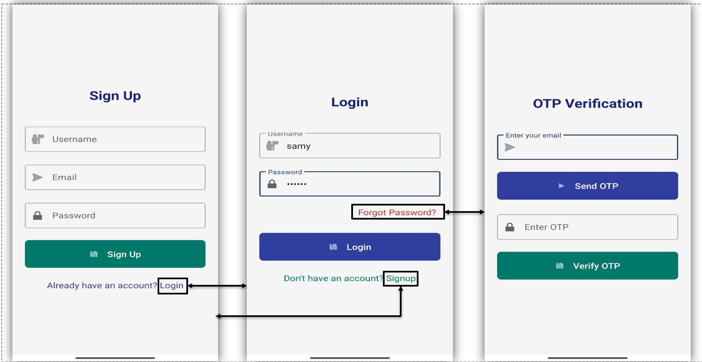

# CrimeConnect

Safety & Crime Reporting Application
A comprehensive safety and security platform that empowers communities to report incidents, communicate emergencies, and collaborate on local safety concerns. This application combines modern web technologies with critical safety features to create a robust system for crime reporting and emergency response.

# 🚀 Overview
This application serves as a centralized platform for community safety, offering users the ability to report crimes, request emergency assistance, and participate in community-driven safety discussions. Built with security and user experience as top priorities, the system ensures reliable communication during critical situations while maintaining data privacy and integrity.

# 📋 Table of Contents

Features
System Modules
Installation
Usage
Security Features
API Documentation
Contributing
License
Support

# ✨ Features

Secure User Authentication with password reset capabilities
Emergency SOS System with real-time location tracking
Crime Reporting with multimedia evidence support
Community Forum with AI-powered moderation
Offline Functionality for critical operations
Real-time Notifications for emergency situations
Multi-platform Support (Web, Mobile)

# 🏗️ System Modules
# 1. User Authentication Module
The User Authentication Module provides a simple and secure way for users to access the application. It ensures that only registered users can log in while maintaining data privacy and security.
Key Features:
User Registration & Login

Secure account creation using username, email, and password
Advanced password hashing techniques for data protection
Input validation to maintain data integrity
Protection against unauthorized access

Forgot Password & Reset Password

Secure password reset via 6-digit OTP sent to registered email
Time-limited OTP to prevent unauthorized access and brute-force attacks
Predefined security guidelines for new password creation
Streamlined password recovery process

Security Measures

Advanced encryption techniques for password storage
Input validation against SQL injection and XSS attacks
HTTPS enforcement for secure data transmission
Comprehensive security protocols

Session Management & Auto Logout

Token-based authentication and secure session IDs
Session timeout and auto logout after inactivity
Session invalidation upon logout or password reset
Protection against session hijacking

# 2. Emergency Communication Module (S.O.S)
A critical safety system that enables users to instantly alert emergency contacts and authorities during dangerous situations. The module combines GPS tracking, offline messaging capabilities, and one-tap activation.
Key Features:
SOS Alert

Instant notification to emergency contacts with pre-configured distress messages
Simultaneous contact notification to maximize response chances
Critical situation details and user needs included in alerts

Live Location Sharing

Continuous GPS coordinate tracking and transmission
Real-time location sharing with emergency contacts and authorities
Background operation for persistent tracking
Quick responder location assistance

One-Tap Assistance

Prominent, easily accessible emergency button
Lock screen activation capability
Accidental activation prevention with fail-safes
Immediate emergency reporting without delays

Emergency Contacts Management

Real-time emergency contact updates
Dedicated contact management interface
Secure contact storage and instant modifications
Preference-based contact list customization

# 3. Crime Reporting Module
The Crime Report module allows users to submit incidents through a structured form that captures crime details, location, and timestamp automatically. Users can upload evidence in multiple formats for comprehensive reporting.
Key Features:
Crime Report Submission

Structured form with essential crime details collection
Automatic location, date, and time capture
Streamlined reporting process with minimal manual input
Comprehensive incident documentation

Evidence Upload

Multimedia evidence support (images, videos, audio)
Secure file upload and preservation
Media optimization for various bandwidth conditions
Complete evidence attachment to reports

Automatic Location & Timestamp Capture

Precise GPS coordinates and timestamp recording
Online and offline functionality
Local data storage until secure connection available
Accurate incident documentation

View Submitted Reports

Dedicated "Your Reports" section for tracking submissions
Real-time status updates and progress tracking
Transparent reporting process with regular updates
Structured overview of historical submissions

# 4. Incident Awareness and Community Forum Module
A collaborative space where community members can share and discuss local safety concerns, suspicious activities, and crime prevention strategies. The module leverages AI moderation and structured discussions.
Key Features:
Community Discussions

Structured discussion threads by incident type and location
Topic-specific following and notification system
Location-based and incident-type filtering
Visual information sharing with privacy protection

Image & Description Sharing

Privacy protection tools (face blurring, sensitive information masking)
Contextual tags and categories for searchability
Visual evidence sharing for suspicious activities
Community-driven safety documentation

AI-Powered Moderation

Machine learning algorithms for content filtering
Inappropriate content, hate speech, and false information detection
Duplicate report identification and thread merging
Automated content organization and quality control

Public Awareness

Safety tips and crime prevention strategy sharing
Emergency response guidelines creation and distribution
Community knowledge contribution platform
Moderated information accuracy and helpfulness

# 🔧 Usage
Getting Started

Register an Account: Create a new account using your email and secure password
Set Up Emergency Contacts: Add trusted contacts for emergency situations
Configure Location Services: Enable GPS for accurate incident reporting
Explore Community Forum: Join discussions about local safety concerns

Emergency Procedures

SOS Activation: Press and hold the emergency button for 3 seconds
Location Sharing: Ensure location services are enabled for real-time tracking
Contact Notifications: Emergency contacts will receive immediate alerts with your location

# Crime Reporting

Access Report Form: Navigate to the crime reporting section
Fill Required Details: Provide incident type, description, and circumstances
Upload Evidence: Attach photos, videos, or audio recordings if available
Submit Report: Review and submit your report for processing

# 🔐 Security Features

End-to-End Encryption for sensitive communications
Multi-Factor Authentication for enhanced account security
Secure File Storage with encrypted evidence uploads
Privacy Controls for community forum participation
Data Anonymization options for sensitive reports
Regular Security Audits and vulnerability assessments

## Screenshots

